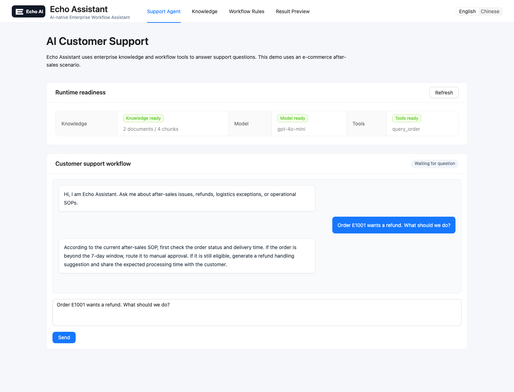
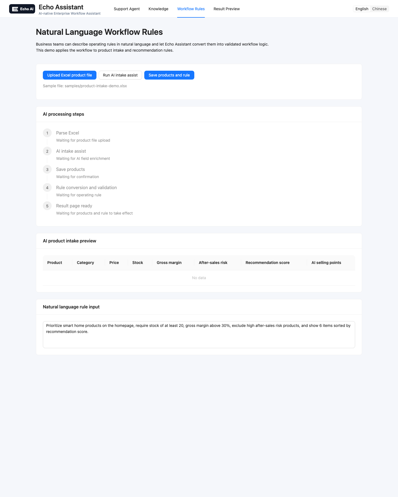
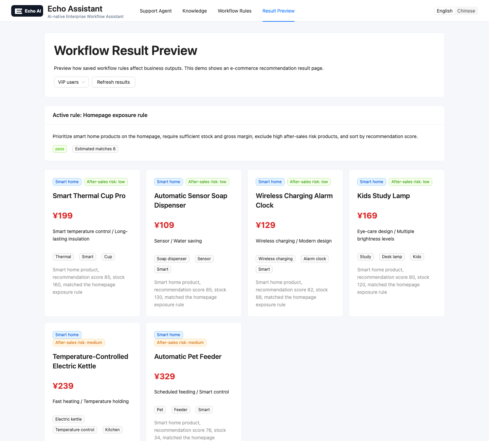

# Echo Assistant

[中文 README](README.zh.md)

**AI-native Enterprise Workflow Assistant**

Echo Assistant is an AI-native workflow assistant designed for enterprise operations, customer support automation, knowledge-driven task execution, and natural language driven business workflows.

Echo Assistant helps teams automate customer support and operational workflows using AI.

## Core Features

### AI Customer Support

Answers customer and internal support questions from an enterprise knowledge base, with source-aware responses and workflow-specific suggestions.

### Natural Language Workflow Rules

Turns plain-language operating policies into executable workflow logic, so business teams can configure rules without writing code.

### Workflow Automation

Connects knowledge retrieval, AI reasoning, validation, and tool calls into repeatable workflows for operations teams.

## Demo Scenario

The current demo uses e-commerce operations as one example scenario:

- Customer support QA for refund and after-sales policies
- Natural language recommendation and exposure rules
- Product intake, enrichment, and recommendation result preview

The product positioning is broader than this demo. Echo Assistant is intended to support enterprise workflows across support, operations, internal knowledge, approval flows, and other process-heavy teams.

## Architecture

```text
User
  ↓
React Frontend
  ↓
Node.js API
  ↓
AI Orchestration / RAG
  ↓
Workflow Engine
  ↓
Business Tools & Data
```

## Screenshots

### Customer Support QA



### Natural Language Workflow Rule



### Recommendation Result Preview



## Tech Stack

- Frontend: React + Vite + Ant Design + TypeScript
- Backend: Express + TypeScript + LangChain + LangGraph + Zod + Dotenv
- AI orchestration with knowledge retrieval, streaming responses, and tool calls
- Local workflow data for demo products, recommendation rules, knowledge, and orders

## Example Workflow

1. Upload enterprise policies, SOPs, or internal documents
2. Ask a support or operations question in natural language
3. Echo Assistant retrieves relevant knowledge and checks workflow context
4. Echo Assistant generates an actionable answer or converts an operating rule into executable workflow logic

Example:

> User: Customer requests refund after 7 days. What should we do?

> Echo Assistant: According to the refund SOP, orders exceeding 7 days require manual approval from operations. Suggested response template has been generated.

## Run Locally

```bash
npm install
cp server/.env.example server/.env
# edit server/.env and set OPENAI_API_KEY / OPENAI_BASE_URL / OPENAI_MODEL
npm run dev
```

Frontend: http://localhost:5173

Backend: http://localhost:3001

## OpenAI Config

`server/.env` supports custom OpenAI-compatible API hosts:

```bash
OPENAI_API_KEY=your_api_key
OPENAI_BASE_URL=https://api.openai.com
OPENAI_MODEL=gpt-4o-mini
```

`OPENAI_BASE_URL` can be either a host or a `/v1` base URL. The server normalizes `https://your-host` to `https://your-host/v1`.

## Project Structure

```text
client/
  src/
    App.tsx                 # Product shell and workflow scenario pages
server/
  data/
    seed/ecommerce-sop.md   # Built-in demo SOP knowledge
    orders.csv              # Mock demo order data for query_order tool
  src/
    app.ts                  # Express app entry and middleware injection
    apis/                   # API route definitions
    controllers/            # Request validation and business orchestration
    middlewares/            # App middleware and error handling
    services/               # Agent, knowledge, product, and workflow services
samples/
  product-intake-demo.xlsx
  smart-thermos-after-sales-sop.md
```

## API Demo

```bash
curl -X POST http://localhost:3001/api/chat \
  -H "Content-Type: application/json" \
  -d '{"message":"订单 E1001 用户想退款，应该怎么处理？","sessionId":"demo"}'
```

Useful APIs:

- `GET /api/readiness`: knowledge, model, and tool readiness
- `GET /api/knowledge`: list knowledge documents
- `POST /api/knowledge`: add a knowledge document with `{ "title": "...", "content": "..." }`
- `GET /api/knowledge/:id`: preview a knowledge document
- `DELETE /api/knowledge/:id`: delete uploaded knowledge
- `POST /api/chat/stream`: stream agent status, answer tokens, and final trace data by SSE
- `POST /api/products/enrich`: enrich product intake rows for the demo workflow
- `POST /api/recommendations/rules`: convert a natural language demo rule into executable recommendation logic
- `GET /api/recommendations/feed`: preview recommendation results from saved demo rules
